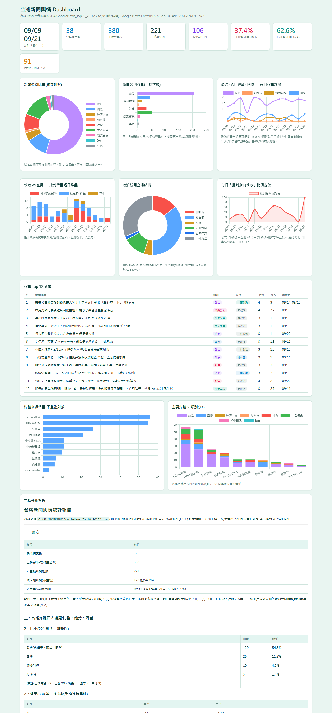

# 台灣新聞輿情 Dashboard · Google News Top10 彙整分析

資料期間 **2026/09/09–09/21**(13 天,38 個快照檔,380 筆上榜記錄,去重後 221 則不重複新聞),
分析台灣新聞的**執政 vs 在野批判比例、趨勢、聲量**,以及**政治 / AI / 經濟 / 國際**四大議題的比重與逐日聲量。

## 檔案說明

| 檔案 | 內容 |
|---|---|
| `dashboard.html` | 互動式儀表板(Chart.js,含完整分析報告),直接用瀏覽器開啟即可 |
| `統計報告.md` | 完整統計報告 |
| `classified_all.csv` | 380 筆明細(日期/排名/標題/類別/立場/來源) |
| `stats.json` | 統計資料(圖表資料源) |
| `final_analyze.py` / `build_dashboard.py` | 分析與儀表板產生腳本 |

## 核心發現(2026/09/09–09/21)

- **議題比重**:政治 54.3%、國際 11.8%、經濟 4.5%、AI 科技 1.4%(政治+國際+經濟+AI 合計 71.9%)
- **批判聲量比例**:批判在野(藍白)62.6% vs 批判執政(綠)37.4%,互批折半計
- **趨勢**:09/09–12 火力集中在在野(張俊傑共諜逃亡案、蔣萬安爭議、藍白內鬥);09/16–17 不副署「違憲」爭議使批判指向執政升至 65.4%、58.3%;09/18–21 選戰「洋流」主導,沈伯洋正面聲量大爆發(正面執政 13 則)

## 方法論

關鍵字規則分類(類別 + 政治立場)+ 全部 221 則逐則人工覆核。
僅依標題語意,Top10 榜單反映 Google News 熱度演算法,非全媒體版面。

## 資料來源

`G:\我的雲端硬碟\GoogleNews_Top10_2026*.csv`(Google News 台灣熱門新聞 Top 10 定期快照;原始快照檔保留於 Google Drive,本倉庫以 `classified_all.csv` 作為去重分類後的明細資料)
